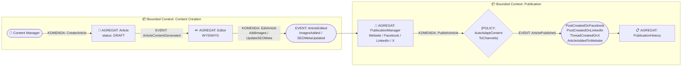
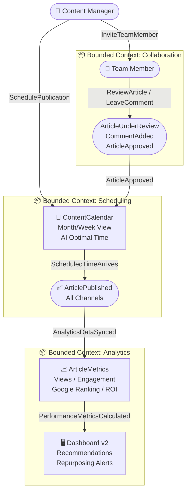

# Event Storming - AS-IS (Stan Bieżący) i TO-BE (Stan Przyszły)

## 1. WPROWADZENIE DO EVENT STORMING

### Co to jest Event Storming?
Event Storming to technika modelowania procesów biznesowych gdzie:
- **Event** (Zdarzenie) = Rzecz która się stała w systemie (np. "ArticlePublished")
- **Command** (Komenda) = Akcja którą użytkownik lub system wykonuje (np. "PublishArticle")
- **Actor** (Aktor) = Użytkownik lub system inicjujący akcję
- **Aggregate** (Agregat) = Encja biznesowa gromadząca logikę (Article, User, Channel)
- **Policy** (Polityka) = Reguła biznesowa uruchamiana w odpowiedzi na event
- **Bounded Context** = Logiczny granica domenowa

---

## 2. EVENT STORMING - AS-IS (BIEŻĄCY STAN)

### 2.0 Diagram Wizualny AS-IS (Mermaid)



---

### 2.1 Główny Przepływ - Tworzenie i Publikacja Artykułu

```
┌─────────────────────────────────────────────────────────────────────────┐
│                     EVENT STORMING - AS-IS                              │
│              Tworzenie i Publikacja Artykułu w Floowe                   │
└─────────────────────────────────────────────────────────────────────────┘

┌──────────────┐
│   AKTOR 1    │
│   Content    │
│   Manager    │
└──────┬───────┘
       │
       │ KOMENDA: CreateArticleFromSuggestion
       ▼
┌───────────────────────────────────────────┐
│ AGREGAT: Article                          │
│ ────────────────────────────────────────  │
│ • articleId: UUID                         │
│ • title: string                           │
│ • content: string                         │
│ • images: Image[]                         │
│ • seoMeta: SEO                           │
│ • status: DRAFT|PUBLISHED|ARCHIVED       │
│ • createdAt: timestamp                    │
│ • publishedAt: timestamp                  │
└───────────────────────────────────────────┘
       │
       │ EVENT: ArticleContentGenerated
       │ (AI wygenerował treść)
       ▼
┌───────────────────────────────────────────┐
│ AGREGAT: Editor                           │
│ ────────────────────────────────────────  │
│ • Umożliwia edycję treści                │
│ • WYSIWYG Interface                      │
│ • Preview mode                           │
└───────────────────────────────────────────┘
       │
       │ KOMENDA: EditArticle
       │ KOMENDA: AddImages
       │ KOMENDA: UpdateSEOMeta
       ▼
       │ EVENT: ArticleEdited
       │ EVENT: ImagesAdded
       │ EVENT: SEOMetaUpdated
       ▼
┌───────────────────────────────────────────┐
│ AGREGAT: PublicationManager               │
│ ────────────────────────────────────────  │
│ • availableChannels:                      │
│   - Website (WordPress/custom)            │
│   - Facebook                              │
│   - LinkedIn                              │
│   - X (Twitter)                           │
│ • selectedChannels: Channel[]             │
│ • publicationSchedule: timestamp          │
└───────────────────────────────────────────┘
       │
       │ KOMENDA: PublishArticle
       │ (Wybrano kanały i clicknięto Publish)
       ▼
┌───────────────────────────────────────────┐
│ POLICY: AutoAdaptContentToChannels        │
│ ────────────────────────────────────────  │
│ RULES:                                    │
│ • WWW: Full article with all content      │
│ • Facebook: Image + excerpt + link        │
│ • LinkedIn: Professional tone shortened   │
│ • X: Thread of tweets (280 char limit)    │
└───────────────────────────────────────────┘
       │
       │ EVENT: ArticlePublished
       │ (Status -> PUBLISHED)
       │
       │ EVENT: PostCreatedOnFacebook
       │ EVENT: PostCreatedOnLinkedIn
       │ EVENT: ThreadCreatedOnX
       │ EVENT: ArticleAddedToWebsite
       ▼
┌───────────────────────────────────────────┐
│ AGREGAT: PublicationHistory               │
│ ────────────────────────────────────────  │
│ • publishedArticles: Article[]            │
│ • archiveOldArticles: 60+ days            │
│ • deletionPolicy: after 1 year optional  │
└───────────────────────────────────────────┘
       │
       │ (Użytkownik widzi artykuł w Dashboard)
       ▼
┌──────────────┐
│   AKTOR 2    │
│   Analytics  │
│   Engine     │  (przyszłość - nie w AS-IS)
└──────────────┘
```

### 2.2 AS-IS Events Timeline

```
1. UserLoggedIn
   └─→ Dashboard displayed

2. CreateArticleClicked
   └─→ SuggestionsFetched (from AI)
   └─→ ChosenFromSuggestions or OwnIdea

3. ArticleContentGenerated
   └─→ AI processed keywords and topic
   └─→ Generated: Title, Sections, CTA, SEO meta

4. ArticleLoadedInEditor
   └─→ User sees WYSIWYG editor
   └─→ Article status: DRAFT

5. EditorContentEdited (multiple times)
   └─→ Title changed
   └─→ Sections modified
   └─→ SEO keywords updated

6. ImagesAdded
   └─→ User uploaded image OR
   └─→ Selected from stock OR
   └─→ AI generated image

7. ArticlePreviewShown
   └─→ User sees how article looks on WWW

8. PublicationChannelsSelected
   └─→ Facebook: YES
   └─→ LinkedIn: YES
   └─→ X: YES
   └─→ Website: YES

9. PublishButtonClicked
   └─→ Triggered PublishArticle command

10. ArticlePublished
    └─→ Status: DRAFT → PUBLISHED
    └─→ publishedAt timestamp recorded

11. ChannelPublicationTriggered
    └─→ Facebook API called
    └─→ LinkedIn API called
    └─→ X API called
    └─→ Website CMS API called

12. PostCreatedOnFacebook
    └─→ Post visible on Facebook page

13. PostCreatedOnLinkedIn
    └─→ Post visible on LinkedIn company page

14. ThreadCreatedOnX
    └─→ Tweets visible on X profile

15. ArticleAddedToWebsite
    └─→ Blog post visible on website
    └─→ SEO metatags indexed by Google crawler

16. UserNotified
    └─→ Email: "Your article published on 4 channels"
    └─→ Dashboard: success badge
```

### 2.3 AS-IS Pain Points / Missing Events

```
❌ NO: AnalyticsTracked
   Problem: Użytkownik nie widzi metryki
   Missing: CTR, views, conversions

❌ NO: TeamNotified
   Problem: Jeden user, brak współpracy
   Missing: Comments, approvals, tag @team

❌ NO: ContentCalendarPlanned
   Problem: Brak planowania na miesiąc
   Missing: Schedule view, bulk publishing

❌ NO: AdaptivePublicationScheduled
   Problem: Publikujesz natychmiast
   Missing: Best time to post (AI suggestion)

❌ NO: AIContentToneAdjusted
   Problem: AI pisze mono-tonem
   Missing: Professional/casual/humorous tones

❌ NO: CompetitorContentAnalyzed
   Problem: Nie wiesz czy treści są competitive
   Missing: Benchmarking vs competitors

❌ NO: UnusedArticlesRepurposed
   Problem: Stary content zarabia pył
   Missing: Repurposing suggestions
```

---

## 3. EVENT STORMING - TO-BE (STAN PRZYSZŁY)

### 3.0 Diagram Wizualny TO-BE (Mermaid)



---

### 3.1 Dodane Events i Commands (Nowe Funkcjonalności)

```
┌─────────────────────────────────────────────────────────────────────────┐
│              EVENT STORMING - TO-BE (STAN PRZYSZŁY)                      │
│     Floowe z Advanced Analytics, Collaboration i ContentCalendar        │
└─────────────────────────────────────────────────────────────────────────┘

                            TIER 1: PUBLICATION
                    (Current - rozszerzone o analitykę)

┌──────────┐
│ AKTOR 1  │  "ContentTeamLead"
│ User     │
└──────┬───┘
       │
       │ KOMENDA: CreateArticleWithCollaboration
       ▼
┌────────────────────────────────────┐
│ AGREGAT: Article v2                │
│ (Enhanced s Analytics)             │
│ ────────────────────────────────── │
│ • articleId: UUID                  │
│ • title, content, images, seoMeta  │
│ • status: DRAFT|UNDER_REVIEW|      │
│         APPROVED|PUBLISHED         │
│ • collaborators: User[]            │
│ • reviews: Review[]  ← NEW          │
│ • targetAudience: string ← NEW      │
│ • contentTone: enum ← NEW           │
│ • plannedPublishDate: timestamp ← NEW
└────────────────────────────────────┘
       │
       │ KOMENDA: InviteTeamMember (NEW)
       ▼
┌────────────────────────────────────┐
│ EVENT: TeamMemberInvited (NEW)     │
│ ────────────────────────────────── │
│ • articleId                        │
│ • memberId                         │
│ • role: EDITOR|REVIEWER|APPROVER   │
└────────────────────────────────────┘
       │
       │ KOMENDA: ReviewArticle (NEW)
       │ KOMENDA: ApproveArticle (NEW)
       │ KOMENDA: RequestRevisions (NEW)
       ▼
┌────────────────────────────────────┐
│ EVENT: ArticleUnderReview (NEW)    │
│ EVENT: ArticleApproved (NEW)       │
│ EVENT: RevisionRequested (NEW)     │
│ ────────────────────────────────── │
│ Review workflow implemented        │
└────────────────────────────────────┘
       │
       │ KOMENDA: SchedulePublication (NEW)
       │ (zamiast publikuj natychmiast)
       ▼
┌────────────────────────────────────┐
│ AGREGAT: ContentCalendar (NEW)     │
│ ────────────────────────────────── │
│ • scheduledPublications[]          │
│ • visualCalendarView: Month/Week   │
│ • bulkActions: Schedule series     │
│ • AIOptimalTime: timestamp         │
└────────────────────────────────────┘
       │
       │ EVENT: PublicationScheduled (NEW)
       │ (Status -> SCHEDULED)
       ▼
┌────────────────────────────────────┐
│ POLICY: OptimalPublishTime (NEW)   │
│ ────────────────────────────────── │
│ Analyzes:                          │
│ • Audience timezone distribution   │
│ • Historical engagement patterns   │
│ • Competitor publishing schedule   │
│ • Social media peak hours          │
│ └─→ Suggests best time             │
└────────────────────────────────────┘
       │
       │ (Scheduled time arrives)
       │ POLICY: AutoPublish (on schedule)
       ▼
       │ EVENT: ScheduledPublicationTriggered (NEW)
       ▼
┌────────────────────────────────────┐
│ (Same as AS-IS publication flow)   │
│ • ArticlePublished                 │
│ • PostCreatedOnChannels            │
│ • UserNotified                     │
└────────────────────────────────────┘

                          TIER 2: ANALYTICS (NEW)
                     Track performance post-publishing

       ▼
┌──────────┐
│ AKTOR 2  │  "Analytics Engine" (system)
│ System   │  Google Analytics 4 + Search Console
└──────┬───┘
       │
       │ EVENT: AnalyticsDataSynced (NEW)
       │ (Every 6 hours automatic)
       ▼
┌────────────────────────────────────┐
│ AGREGAT: ArticleMetrics (NEW)      │
│ ────────────────────────────────── │
│ Per Article:                       │
│ • pageViews: number                │
│ • uniqueVisitors: number           │
│ • averageTimeOnPage: seconds       │
│ • bounceRate: percent              │
│ • clickThroughRate: percent        │
│ • conversionCount: number          │
│ • socialEngagement: {likes, shares}│
│ • googleRanking: position          │
│ • searchImpressions: number        │
│ • organicTraffic: number           │
└────────────────────────────────────┘
       │
       │ EVENT: PerformanceMetricsCalculated (NEW)
       │ (Real-time dashboard updates)
       ▼
┌────────────────────────────────────┐
│ AGREGAT: Dashboard v2 (NEW)        │
│ ────────────────────────────────── │
│ Displays:                          │
│ • This Month: articles published   │
│ • Top Performing Article           │
│ • Traffic Sources                  │
│ • Engagement by Platform           │
│ • ROI Estimate: (Traffic × Rate)   │
│ • Content Gaps: topics missing     │
│ • Suggestions: repurpose old posts │
└────────────────────────────────────┘
       │
       │ USER INTERACTS:
       │ Click on article → Detailed Analytics Page
       ▼
┌────────────────────────────────────┐
│ AGREGAT: ArticleDetailView (NEW)   │
│ ────────────────────────────────── │
│ Shows performance per channel:     │
│ √ WWW Blog:                        │
│   - Views, Click rate, Time on page│
│ √ Facebook:                        │
│   - Reach, Engagement, ClickRate   │
│ √ LinkedIn:                        │
│   - Impressions, Reactions, Clicks │
│ √ X (Twitter):                     │
│   - Impressions, Retweets, Likes   │
│                                    │
│ + Recommendation:                  │
│   "This article ranks for keyword  │
│    'finance tips' on Google. Try   │
│    repurposing for YouTube video"  │
└────────────────────────────────────┘

                    TIER 3: TEAM COLLABORATION (NEW)

┌──────────┐
│ AKTOR 3  │  "TeamMember" (reviewer)
│ User     │
└──────┬───┘
       │
       │ NOTIFICATION: ArticleReadyForReview (NEW)
       ▼
       │ Email: "John shared article for review"
       │ In-app: Banner on Dashboard
       ▼
       │ KOMENDA: ViewArticleForReview (NEW)
       │ KOMENDA: LeaveComment (NEW)
       │ KOMENDA: ApproveArticle (NEW)
       │ KOMENDA: RequestRevisions (NEW)
       ▼
       │ EVENT: CommentAdded (NEW)
       │ EVENT: ArticleApproved (NEW)
       │ EVENT: RevisionRequested (NEW)
       ▼
       │ POLICY: NotifyOriginalAuthor (NEW)
       │ └─→ Email: "Your article was approved!"
       │ └─→ Email: "Revisions requested: ..."
       ▼
┌────────────────────────────────────┐
│ AGREGAT: TeamWorkflow (NEW)        │
│ ────────────────────────────────── │
│ • Articles awaiting review: 2      │
│ • Approved articles: 15            │
│ • Articles with revisions: 3       │
│ • Team member activity log         │
└────────────────────────────────────┘
```

### 3.2 TO-BE Events Summary (24 nowe eventy)

```
COLLABORATION TIER:
1. TeamMemberInvited
2. PermissionsAssigned
3. CommentAdded
4. ArticleUnderReview
5. ArticleApproved
6. RevisionRequested
7. NotificationSent

SCHEDULING TIER:
8. PublicationScheduled
9. OptimalPublishTimeCalculated
10. ScheduledPublicationTriggered
11. PublicationScheduleChanged

ANALYTICS TIER:
12. AnalyticsDataSynced
13. PerformanceMetricsCalculated
14. ThresholdAlertTriggered (LOW performance)
15. SuggestionsGenerated (for optimization)
16. ArticleRepurposingRecommended

CONTENT ENHANCEMENT TIER:
17. ContentToneSelected (Professional/Casual/Humorous)
18. AIToneAdjustmentApplied
19. TargetAudienceDefinedChanged
20. KeywordGapAnalysisCompleted

REPORTING TIER:
21. MonthlyReportGenerated
22. PerformanceComparisionCalculated
23. ContentCalendarExported (to PDF)

RETENTION/GROWTH TIER:
24. ChurnRiskDetected (no activity 30 days)
```

---

## 4. PORÓWNANIE AS-IS vs TO-BE

| Aspekt | AS-IS | TO-BE |
|--------|-------|-------|
| **Tworzenie** | Solo creation | Team collaboration + review workflow |
| **Publikacja** | Instant publish | Schedule + AI optimal time |
| **Planowanie** | Ad-hoc | Content Calendar with visual planning |
| **Analytics** | None | Real-time metrics per channel |
| **Performance** | No visibility | Dashboard + detailed breakdown |
| **ROI** | Unknown | Estimated daily/monthly ROI |
| **Content Reuse** | Manual | AI recommendations for repurposing |
| **Team Communication** | External tools | Built-in comments & approvals |
| **Optimization** | Guesswork | Data-driven suggestions |
| **Notifications** | Email only | Email + In-app + Slack integration |

---

## 5. MAPA SYSTEMÓW I INTEGRACJI

### AS-IS Systemy
```
┌─────────────────────────────────────┐
│  Frontend (React/Vue)               │
│  • Dashboard                        │
│  • Editor (WYSIWYG)                 │
│  • Settings                         │
└────────────┬────────────────────────┘
             │
             ▼
┌─────────────────────────────────────┐
│  Backend API (Node.js/Python)       │
│  • User Management                  │
│  • Article CRUD                     │
│  • AI Integration (OpenAI)           │
│  • OAuth handlers                   │
└────────┬────────────┬────────────┬──┘
         │            │            │
         ▼            ▼            ▼
    ┌────────┐  ┌────────┐  ┌──────────┐
    │Facebook│  │LinkedIn│  │X/Twitter │
    │Graph   │  │API     │  │API       │
    │API     │  │        │  │          │
    └────────┘  └────────┘  └──────────┘

    + External CMS (WordPress API)
```

### TO-BE Systemy (added)
```
                    (ALL OF AS-IS +)

┌─────────────────────────────────────┐
│  Analytics Service (NEW)            │
│  • Google Analytics 4 API            │
│  • Google Search Console API         │
│  • Data warehouse (BigQuery)         │
│  • Metric calculations               │
└─────────────────────────────────────┘

┌─────────────────────────────────────┐
│  Scheduling Service (NEW)           │
│  • Job queue (Redis/Bull)            │
│  • Cron tasks                        │
│  • Optimal time calculator (ML)      │
└─────────────────────────────────────┘

┌─────────────────────────────────────┐
│  Notification Service (NEW)         │
│  • Email (SendGrid)                  │
│  • In-app notifications              │
│  • Slack integration                 │
│  • Webhook support                   │
└─────────────────────────────────────┘

┌─────────────────────────────────────┐
│  Content Recommendation Engine (NEW) │
│  • ML model for repurposing          │
│  • Keyword gap analysis              │
│  • Competitor benchmarking           │
└─────────────────────────────────────┘
```

---

## 6. KRYTYCZNE OBSERWACJE

### AS-IS Obserwacje
✅ **Mocne strony**:
- Prosty, intuicyjny flow
- Szybka publikacja na wiele kanałów
- AI-powered content generation

❌ **Słabe strony**:
- Brak widoczności rezultatów (ROI unknown)
- Zero wsparcia dla teamów
- Brak planowania - wszystko natychmiast
- Trudno ocenić czy artykuł "zarabia"
- Brak upsell oportunity

### TO-BE Obserwacje
+ Team collaboration → wzrost przychodów (dodatkowe płatne seat'y w planie team)
+ Analytics → poprawia retention (użytkownik widzi wartość i zostaje na subskrypcji)
+ Content Calendar → buduje nawyk (regularny tygodniowy workflow = lepsze SEO)
+ AI recommendations → ponowne wykorzystanie istniejących treści (maksymalizacja value bez dodatkowego kosztu)
+ Performance metrics → przewaga konkurencyjna vs Jasper AI (który nie ma wbudowanej analityki)

